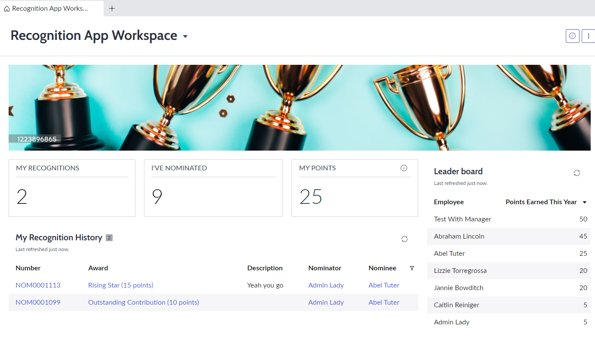
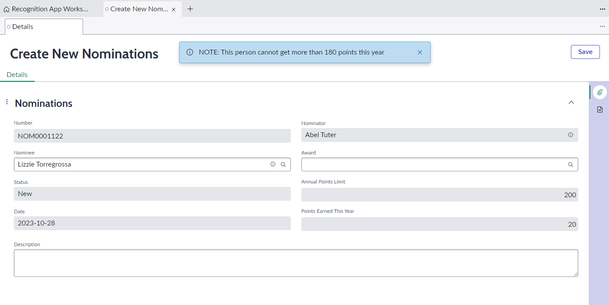
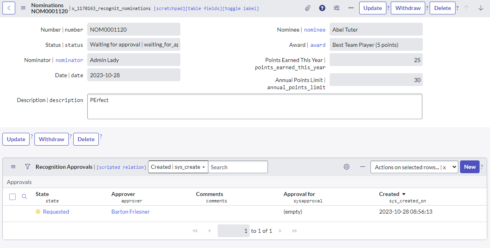

# sn-recognition-app
Application that enables employees to submit nominations and distribute recognition points to their peers.

### Features
A user can nominate their peers with a proper award corresponding with an amount of points
HR has the ability to set the limit of points each employee can receive a year
Manager will receive the nomination and consider to approve or reject it
Employees can track their points and others.

**Create a nomination**
- Auto populate the nominator as the current logged in user
- Populate Points Earned This Year and Annual Points Limit of the nominee
- You can only pick the nominee from from group "Recognition Users", not all the users
- Validation:
  - Cannot nominate yourself
  - Compare the maximum year limit with the point nominated 
  - Cannot choose someone who already passes the limit

**When the nomination is submitted and waiting for approval**
- User can see the list of approvals
- Requester can withdraw the nomination via a button
	- Only show the button if the logged in user is the requestor
	- Reload and stay at the same form after click
	- Cancel the pending approval
   

**When the nomination is approved:**
- Email sent
- A transaction is created
- Update the user's points & points earned in the year
